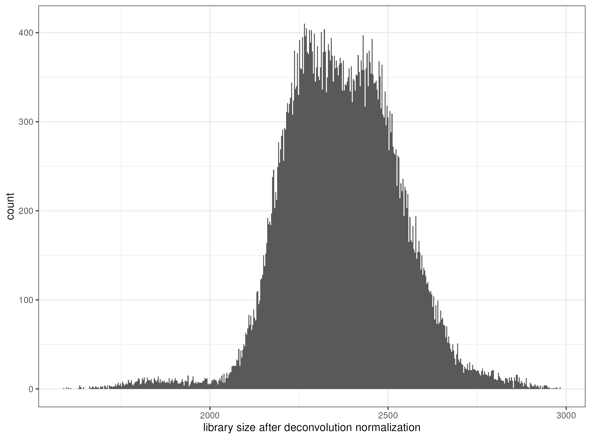

#### {.outline }

<!--
Replace the `img/mainplot.png` image with the appropriate case study image or consider using ottrpal::include_slide() with a publicly viewable slide deck as needed.
See image here for example: https://www.opencasestudies.org/ocs-bp-school-shootings-dashboard/
-->

{fig-alt="Histogram showing the library size of deconvolution normalized expression" width=800 .lightbox}

####
